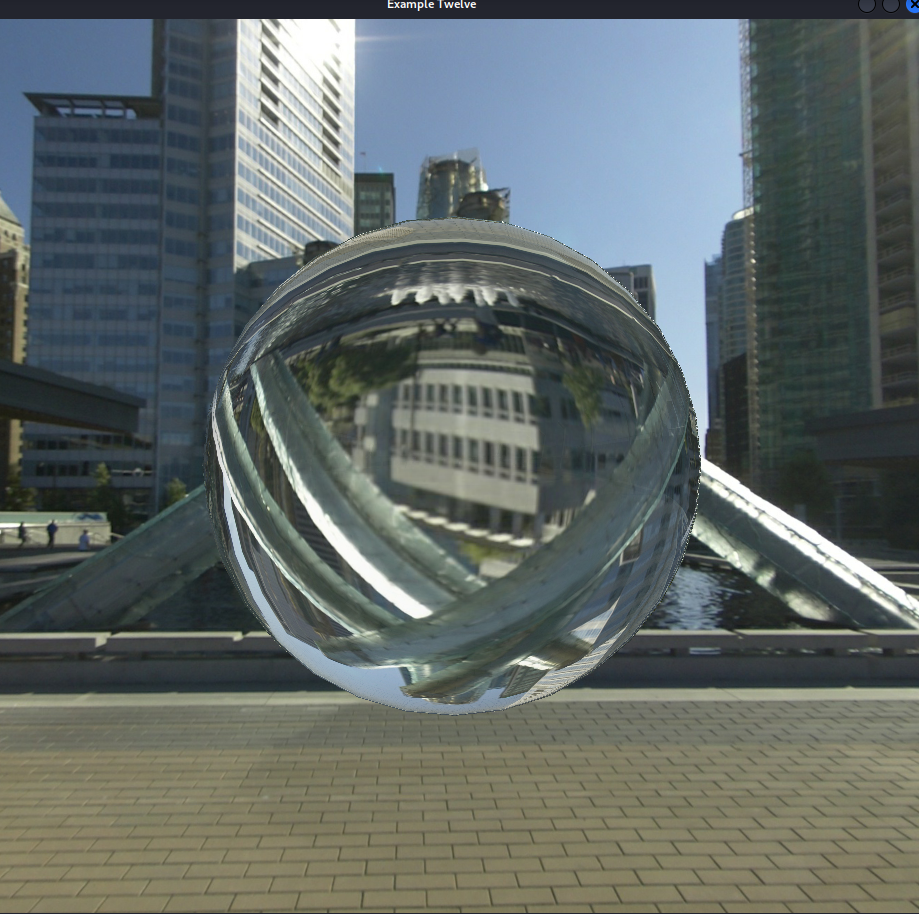
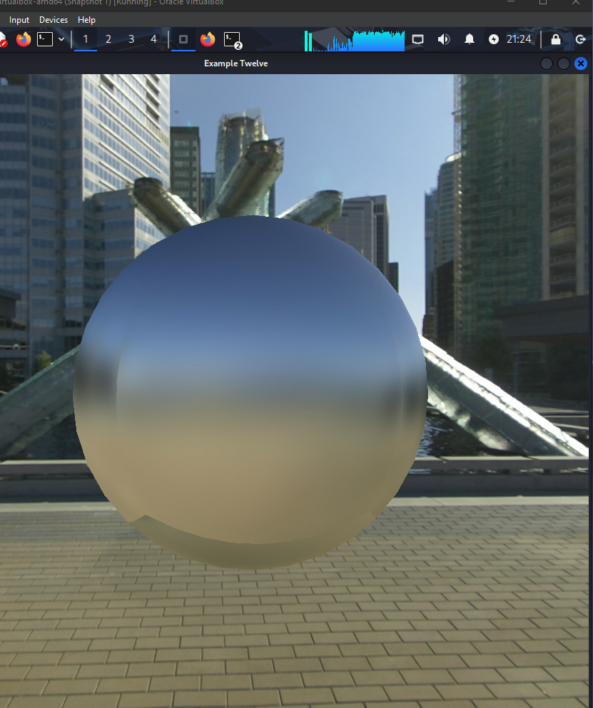
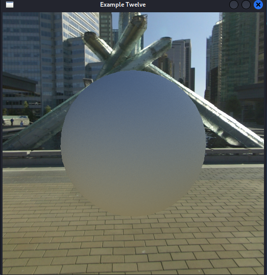

# Assignment 3 Report: Faking Global Illumination on the GPU

**CSCI 3090**  
**Student Name:** Ibrahim Sharar  
**Student Number:** 100753058  
**Email:** ibrahim.sharar@ontariotechu.net  
**Date:** December 2024

## Introduction

This report describes the implementation of techniques for faking global illumination effects in real-time using GPU shaders. The assignment consists of two main parts: (1) Reflection and Refraction with Schlick approximation (50%), and (2) Diffuse Reflection using two different approaches (50%).

## Part 1: Reflection and Refraction (50%)

### Implementation

The first part implements reflection and refraction effects using environment maps. The implementation uses:

- **`reflect()` function**: Computes the reflection vector based on the view direction and surface normal
- **`refract()` function**: Computes the refraction vector using an index of refraction (eta = 1.0/1.5 for glass)
- **Schlick's Fresnel approximation**: Blends between reflection and refraction based on the viewing angle

### Key Code

The fragment shader (`example12b.fs`) implements the following:

1. Compute reflection vector: `R = reflect(-V, N)`
2. Compute refraction vector: `T = refract(-V, N, eta)` where `eta = 1.0 / 1.5`
3. Calculate Fresnel factor using Schlick's approximation:
   ```glsl
   R0 = pow((1.0 - eta) / (1.0 + eta), 2.0)
   F = R0 + (1.0 - R0) * pow(1.0 - dot(V, N), 5.0)
   ```
4. Blend reflection and refraction: `mix(refrColor, reflColor, F)`
5. Handle total internal reflection when the refraction vector becomes zero

### Results



The implementation produces a glass-like sphere that shows both reflection and refraction. The Fresnel effect is visible: more reflection occurs at glancing angles, while more refraction occurs when viewing perpendicular to the surface. The sphere clearly demonstrates the distorted, inverted view of the environment through refraction, while also reflecting the surrounding buildings and sky on its surface.

## Part 2: Diffuse Reflection

### Part 2a: Irradiance Maps

#### Implementation

This approach uses a pre-blurred environment map (irradiance map) to simulate diffuse reflection. The implementation:

1. Uses a blurred version of the environment map (resized from 2048x2048 to ~512x512 and blurred)
2. Samples the irradiance map using the surface normal vector directly
3. Keeps the shader (`example12c.fs`) intentionally minimal: no extra specular or tone mapping, just a clamped irradiance lookup for a clean diffuse result

#### Results



This approach produces a soft, diffuse appearance without sharp reflections. Seams between cube map faces may be visible because the blur is applied per-face rather than across edges.

### Part 2b: Monte Carlo Sampling (50%)

#### Implementation

This approach solves the seam problem by sampling the environment map directly in the fragment shader using Monte Carlo integration. The implementation:

1. **Random Number Generator**: Uses a linear congruential generator (LCG) provided in the assignment:
   - Parameters: `a=141, c=28411, m=134456`
   - Initialized per pixel based on `gl_FragCoord` in the `main()` function for decorrelated seeds

2. **Hemisphere Sampling**: 
   - Uses rejection sampling: generates random vectors uniformly in a sphere and keeps only those with positive dot product with the normal
   - This ensures uniform distribution on the hemisphere above the surface
   - Each sample is weighted by the cosine of the angle (dot product with normal)

3. **Weighted Averaging**:
   - Uniform hemisphere sampling; each sample is weighted by the cosine of the angle (dot product with normal)
   - Final color = weighted sum / sum of weights (avoids over-darkening from double cosine weighting)

4. **Sample Count**: Uses **500 samples** per pixel to achieve reasonable image quality
5. **Seeding**: RNG seed is based on `gl_FragCoord` to avoid repeating patterns across pixels

#### Key Code

The fragment shader (`example12d.fs`) implements:
- Random number generator initialized in `main()` function
- Cosine-weighted hemisphere sampling function
- Loop over 500 samples, accumulating weighted colors
- Final division by sum of weights: `gl_FragColor = weightedSum / weightSum`

#### Results



This approach produces a smooth, diffuse appearance without visible seams. The sphere demonstrates seamless diffuse lighting with a smooth gradient from the sky (blue-grey top) to the ground (beige-grey bottom), accurately reflecting the ambient light from the environment. The quality improves with more samples, but performance decreases. With 500 samples, the image quality is excellent, though rendering is slower than the irradiance map approach.

### Number of Samples

For Part 2b, I used **500 samples** per pixel. This provides a good balance between image quality and performance. With fewer samples (e.g., 100-200), the image becomes noisier. With more samples (e.g., 1000+), the quality improves slightly but the performance penalty is significant.

## Technical Details

### Build Instructions

The project uses a Makefile that works on macOS, Linux, and Windows:

```bash
make                    # Builds both executables
./example12 a b         # Run Part 1
./example12 a d         # Run Part 2b
./example12_irradiance a c  # Run Part 2a
```

### Dependencies

- OpenGL 3.3+ (GLSL 330)
- FreeImage library
- GLFW library
- GLEW library
- Environment map: `VancouverConventionCentre/` directory with 6 cube map images

### File Structure

- **Source files**: `viewer.cpp`, `viewer_irradiance.cpp`, `Shaders.cpp`, `texture.cpp`, `tiny_obj_loader.cc`
- **Shader files**: `example12a.vs`, `example12b.fs`, `example12c.fs`, `example12d.fs`, `cube.vs`, `cube.fs`
- **Model**: `sphere.obj`

## Challenges and Solutions

1. **Total Internal Reflection**: Handled by checking if the refraction vector is zero and using only reflection in that case.

2. **Seam Problem in Part 2a**: The irradiance map approach shows seams because blurring doesn't extend across cube map boundaries. This was solved in Part 2b by sampling directly in the shader.

3. **Performance in Part 2b**: 500 samples per pixel is computationally expensive. The implementation could be optimized by reducing sample count for real-time applications, or using importance sampling techniques.

## Conclusion

All three techniques were successfully implemented:
- Part 1 produces realistic glass-like reflection and refraction
- Part 2a provides efficient diffuse reflection using pre-computed irradiance maps
- Part 2b eliminates seams through Monte Carlo sampling, though at a performance cost

The implementations demonstrate different trade-offs between quality, performance, and complexity in real-time global illumination techniques.

## References

- Assignment 3 Description (ASSIGNMENT_THREE.md)
- GLSL Documentation for `reflect()` and `refract()` functions
- Schlick's Fresnel Approximation
